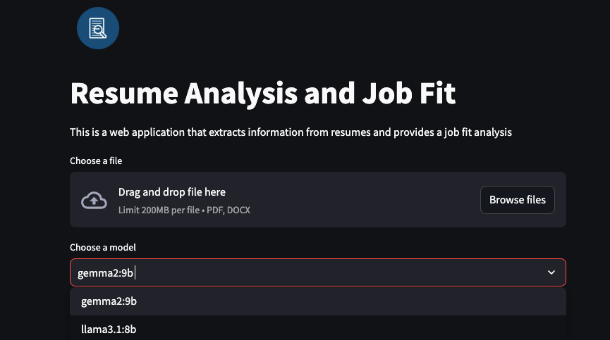

# InfoCV

InfoCV is a resume processing tool that extracts and processes information from PDF and DOCX files using Large Language Models. The tool leverages Ollama to:
## 1. Resume Analysis:
the tool extracts information from the resume and provides a JSON output with the extracted information.


## 2. Job Fit:
the tool matches the extracted information from the resume with the job description to provide a job fit score.


## Table of Contents

- [Installation](#installation)
- [Usage](#usage)
- [Project Structure](#project-structure)
- [Contributing](#contributing)
- [License](#license)
- [Reporting Issues](#reporting-issues)

## Installation

1. Clone the repository:
    ```sh
    git clone https://github.com/bssayla/InfoCV.git
    cd InfoCV
    ```

2. Create and activate a virtual environment:
    ```sh
    python -m venv venv
    source venv/bin/activate  # On Windows use `venv\Scripts\activate`
    ```

3. Install the required packages:
    ```sh
    pip install -r requirements.txt
    ```

4. Set up the environment:
   - If you want to use the local API (**Recommended**):
        - Install the `Ollama` tool from [Ollama Website](https://ollama.com/)
        - Run the following command:
        ```sh
        ollama serve
        ```
        - The local API will be running on `http://localhost:11434`. You will see a message like this:
        ```plaintext
        Ollama is running
        ```
        - You can install any LLM model you want using the following command:
        ```sh
        ollama run <model_name>
        ```
        and all the models you have will appear in the selection list in the Streamlit interface.
        <!-- image -->
        

## Usage

1. Run the Streamlit interface:
    ```sh
    streamlit run app.py
    ```
2. Upload a resume file (PDF or DOCX) and select a model to process the resume.
3. Choose the model you want to use to process the resume.
4. Choose either [`resume analysis`] or [`job fit`] to process the resume.
5. Press the [`Process`] button and let the magic happen!

## Project Structure

```plaintext
InfoCV/
├── app.py
├── data/
│   └── data_raw/
├── images/
├── libs/
│   ├── evaluations/
│   ├── Interface/
│   ├── models/
│   ├── prompts/
│   └── utils/
├── notebooks/
├── tests/
├── .github/
│   └── ISSUE_TEMPLATE/
├── LICENSE
├── README.md
├── pytest.ini
├── requirements.txt
├── setup.py
```

- [`app.py`] : Main application script.
- [`images/`] : Directory for storing images used in the application.
- [`libs/`]: Contains various libraries and modules.
  - `evaluations/`: Scripts for evaluating the models.
  - `Interface/`: Streamlit interface for user interaction.
  - `models/`: Contains the API for processing resumes.
  - `prompts/`: Contains prompt templates for different analyses.
  - `utils/`: Utility scripts for data extraction and logging.
- [`notebooks/`]: Jupyter notebooks for experiments and reports.
- [`tests/`]: Unit tests for the project.
- [`.gitignore`]: Git ignore file.
- [`LICENSE`]: License file.
- [`README.md`]: This README file.
- [`pytest.ini`]: Pytest configuration file.
- [`requirements.txt`]: List of required packages.
- [`setup.py`]: Setup script for the project.

## Contributing

Contributions are welcome! Please check the [Issues Page](https://github.com/bssayla/InfoCv/issues) for a list of tasks and improvements.

1. Fork the repository.
2. Create a new branch (`git checkout -b feature-branch`).
3. Commit your changes (`git commit -am 'Add new feature'`).
4. Push to the branch (`git push origin feature-branch`).
5. Create a new Pull Request.

## License

Free software: [MIT license](LICENSE)

## Reporting Issues

When reporting issues, please use our issue templates. We have templates for different types of issues to ensure we get all the necessary information:

1. **Bug Reports**: Use this template when you encounter a problem with the existing functionality.
2. **Feature Requests**: Use this when you want to suggest a new feature or enhancement.
3. **Documentation Improvements**: Use this to suggest changes or additions to our documentation.

To use a template:
1. Go to the "Issues" tab in our GitHub repository.
2. Click on "New Issue".
3. Choose the appropriate template from the list.
4. Fill out the template with as much detail as possible.

Using these templates helps us address issues more effectively and efficiently. Thank you for your contributions!
